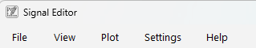

# Menu Bar

The menu bar is the topmost part of the window. It contains the following menus:

## File

The file menu contains commands for opening and closing files or viewing a file's metadata.

## View

The view menu contains commands for toggling the visibility of the [Section List](section_list.md), [Parameter Inputs](parameter_inputs.md) and [Status Log](status_log.md) docks.

## Plot

The plot menu contains commands for removing or finding peaks in a selected area, toggling automatic y-axis scaling and showing an overview of the available [sections](../user_guide/sections.md) in the base plot.

## Settings

The settings menu contains commands for showing the [Settings](../user_guide/configuration.md) dialog.

## Help

The help menu contains commands for showing the [User Guide](../user_guide/introduction.md), [About](../about/license.md) and `About Qt` windows. Also allows toggling the `What's This` mode, in which contextual help is shown when clicking on an UI element.